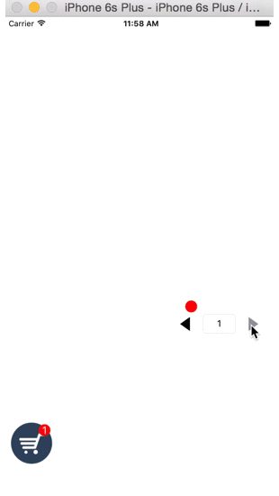

#仿美团购物车

```
@protocol ThrowLineToolDelegate;

@interface ThrowLineTool : NSObject

@property (nonatomic, assign) id<ThrowLineToolDelegate>delegate;
@property (nonatomic, retain) UIView *showingView;

+ (ThrowLineTool *)sharedTool;

/**
 *  将某个view或者layer从起点抛到终点
 *
 *  @param obj    被抛的物体
 *  @param start  起点坐标
 *  @param end    终点坐标
 *  @param height 高度，抛物线最高点比起点/终点y坐标最低(即高度最高)所超出的高度
 */
- (void)throwObject:(UIView *)obj from:(CGPoint)start to:(CGPoint)end
             height:(CGFloat)height duration:(CGFloat)duration;

@end


@protocol ThrowLineToolDelegate <NSObject>

/**
 *  抛物线结束的回调
 */
- (void)animationDidFinish;

@end

```


